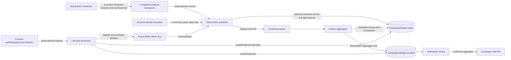

# Campaign Intelligence Data Flow

Status: **Proposed v1** for `SECUR4ALL-202`

## Copy Inventory

| Location | Allowed data | Prohibited data | Deletion behavior |
| --- | --- | --- | --- |
| Completed-analysis source | Existing authoritative result and one random statistics event ID | Governed by the source service contract | Source-service policy |
| Publisher memory | Minimum sanitized input, account ID for token derivation, event ID | Logging or tracing any payload/identity | Released after invocation |
| Clustering queue and DLQ | Envelope version, operation, environment, random event ID, record version | Content, identity, token, indicator, vector | Queue retention; harmless after table deletion |
| CampaignPipeline table | Sanitized observation, validated app features, token, candidates, dedupe, expiry | Direct identity, source request ID, screenshot/OCR body, precise user timestamp | Explicit delete plus TTL safety net; no backup |
| Lambda memory and `/tmp` | One bounded work item | Cross-invocation cache, logs, dumps | Clear files in `finally`; encrypted environment |
| CampaignIntelligence table | Confirmed aggregate, clipped centroid, coarse periods/count bands, state, safe audit | Token, event ID, individual vector/content/identity | 400-day retention and reviewed suppression |
| CloudWatch/X-Ray | Low-cardinality operation/result metrics and AWS trace IDs | Campaign/event/token/content/identity dimensions | Dev 14, UAT 30, Production 90 days |
| Persistent backup | Confirmed aggregate table only | Any CampaignPipeline data | PITR window; normal aggregate retention still enforced |

## Trust Boundaries

1. **Account/analysis boundary:** may know the account and source request. Only the
   publisher and deletion bridge cross this boundary under exact IAM grants.
2. **Transient campaign boundary:** holds pseudonymous records needed for limited
   processing, deduplication, poisoning controls, and deletion.
3. **Durable aggregate boundary:** receives only cohort-approved, non-linkable
   campaign data and cannot read account or transient identity mappings.
4. **Publication boundary:** returns only confirmed, fresh, thresholded aggregates
   and count bands.
5. **Environment boundary:** no event, role, key, queue, table, log, or backup
   deployment crosses Dev, UAT, and Production.

## Failure Rules

- A completed analysis succeeds independently of campaign publication.
- Duplicate stream and queue deliveries converge through the statistics event ID
  and conditional writes.
- A missing, expired, deleted, or suppressed transient item is a successful no-op.
- Schema-invalid work is quarantined without payload logging.
- A DLQ contains only opaque identifiers; replay rechecks consent, expiry, and
  current record version.
- Lifecycle or deletion failure blocks period finalization and raises an alarm.
- Persistent aggregates are never reconstructed from expired transient data.
